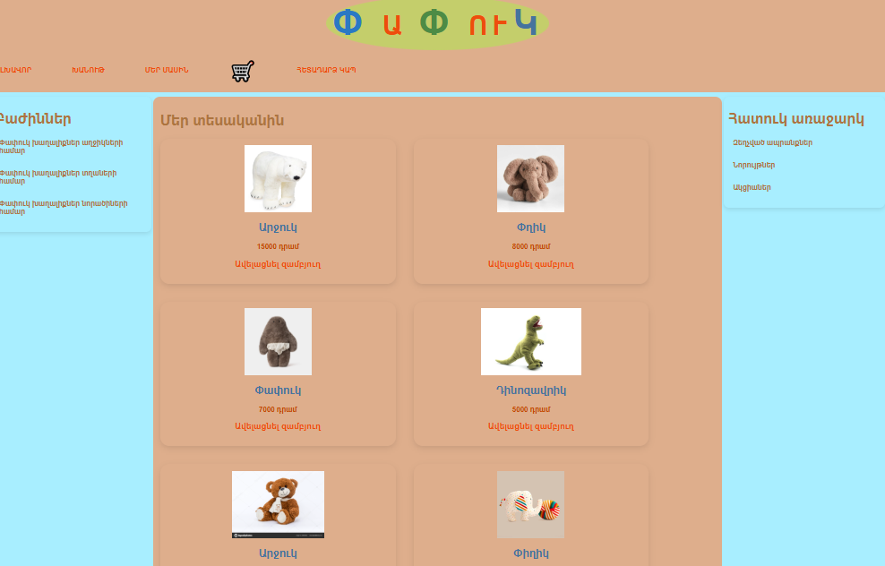

# Laravel E-commerce Project

##Features
-Product list
-Cart system
-Image upload
-Laravel +MySQL

## Technologies
-HTML
-CSS
-JavaScript
-PHP
MySQL

## Setup
1. Clone the repository
2. Run` composer install`
3. Copy`.evn.example` to `.evn` and configure database
4. Run `php artisan key:generate`
5. Run `php artisan serve` to start the server

# Screenshots
### Home Page

### About Page

### Product Page

### One Product Page

### Cart Page

### Contact Page

### Asides

